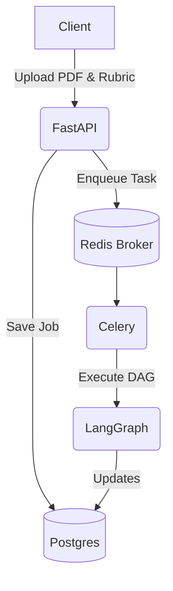

# P1 Walkthrough

## 1. What P1 owns
| Area | Folders | Public Functions | Connects to |
| --- | --- | --- | --- |
| Platform & API | `api/`, `core/`, `workers/`, `pipeline/` | `app`, `run_pipeline`, `build_graph` | P5 (Web frontend uses API) |
| Scorer | `scorer/` | `score(state)` | P2 (Extraction), P4 (Evaluation) |
| Infrastructure | `migrations/`, `deploy/`, `docker-compose.yml`, `.github/`, `scripts/` | `make up`, CI workflows | Entire team |

## 2. Architecture in 60 seconds
AutoRubric is an asynchronous grading platform. The user submits a PDF and a Rubric via the FastAPI interface. The API creates a database job and queues a Celery task. The Celery worker runs a LangGraph pipeline that extracts text, chunks it, retrieves criteria, evaluates them, scores deterministically, and audits the result. The API can poll the database for status and retrieve the final annotated PDF.

## 3. Status board
| Item | Day | Status | Evidence |
| --- | --- | --- | --- |
| Project structure & Docker | 1 | DONE | `make up` works |
| CI & Coverage setup | 1 | DONE | `ci.yml` passes |
| Scorer deterministic logic | 2 | DONE | `pytest tests/unit/scorer` |
| Pipeline state & db tracking | 2 | DONE | `tests/integration/test_pipeline.py` |
| Verification endpoint | 2 | DONE | `GET /jobs/{id}` |
| Integration Safe-fallbacks | 3 | TODO | `STAGE_MODE` config pending |
| E2E test with real PDF | 3 | TODO | Fixture integration pending |
| Cohorts & batch upload | 3 | TODO | `POST /submissions/batch` pending |
| Reliability review | 4 | TODO | Check for N+1 queries |
| Security checklist | 4 | TODO | `SECURITY.md` |
| Release | 4 | TODO | v0.1.0 tag |

## 4. File map
- `api/main.py`: FastAPI application entrypoint.
- `core/db.py`: SQLAlchemy setup and models.
- `workers/celery_app.py`: Celery app initialization.
- `pipeline/graph.py`: LangGraph DAG definition.
- `scorer/__init__.py`: Pure scoring logic with `networkx`.
- `tests/`: Pytest suite (unit and integration).
- `docker-compose.yml`: Local infrastructure definition.

## 5. How to run
- Start DB/Redis: `make up`
- Migrate DB: `make migrate`
- Test: `make test`
- Demo: `make demo` (Requires `make up` and `make migrate`)

## 6. API reference
| Method | Path | Auth | Purpose |
| --- | --- | --- | --- |
| POST | `/auth/login` | None | Get JWT token |
| POST | `/submissions` | JWT | Submit a PDF for grading |
| GET | `/jobs/{id}` | JWT | Check job status |

## 7. Scoring rules as implemented
The scorer operates as a pure function using topological sort on the rubric's dependency graph.
Example: Criterion C1 (Base, 1.0 marks). Criterion C2 (Bonus, 0.5 marks, depends on C1).
If C1 is FULL_CREDIT (1.0), C2 is evaluated. If C1 is MISCONCEPTION (0.0), C2 is skipped.
If an untrusted evaluation assigns marks, those marks are excluded from the total score, and a `needs_review` flag is raised.
Total score = sum of earned marks constrained by the rubric's max score.

## 8. Key design decisions and why
- **Deterministic Scoring**: Extracted to a pure function using Decimal math and topological sort to guarantee reproducibility and prevent side effects.
- **Fail-closed missing verdicts**: Missing evaluation results default to zero score for that criterion to prevent accidental credit.
- **Event-driven tracking**: Job status is tracked in Postgres with events (`JobEvent`) to provide fine-grained observability of LangGraph steps.
- **Asynchronous pipeline**: Celery isolates heavy processing from the API to keep web requests snappy.

## 9. Known limitations and risks
- Large PDFs might consume excessive memory in Celery workers.
- The pipeline doesn't yet support resuming from a failed stage automatically.
- No GPU isolation implemented yet for the evaluator.

## 10. What is left to do
- Add `STAGE_MODE` configuration for integration testing (P1).
- Add GPU worker queues for evaluation (P1).
- Fix remaining module dependencies for E2E (All).
- Add endpoints for bulk uploading cohorts (P1).

## 11. Viva prep
- **Q: Why Celery?** A: Standard, robust asynchronous task queue that pairs well with Redis for brokering and Postgres for results.
- **Q: Why LangGraph?** A: Provides a clean way to model the processing pipeline as a state machine.
- **Q: How does deterministic scoring work?** A: Topological sorting ensures dependencies are scored first.

## 12. Change log
- Day 1: Project setup, contracts, stubs, and CI configurations.
- Day 2: Added scorer logic, pipeline event tracking, real auth, and tests.
