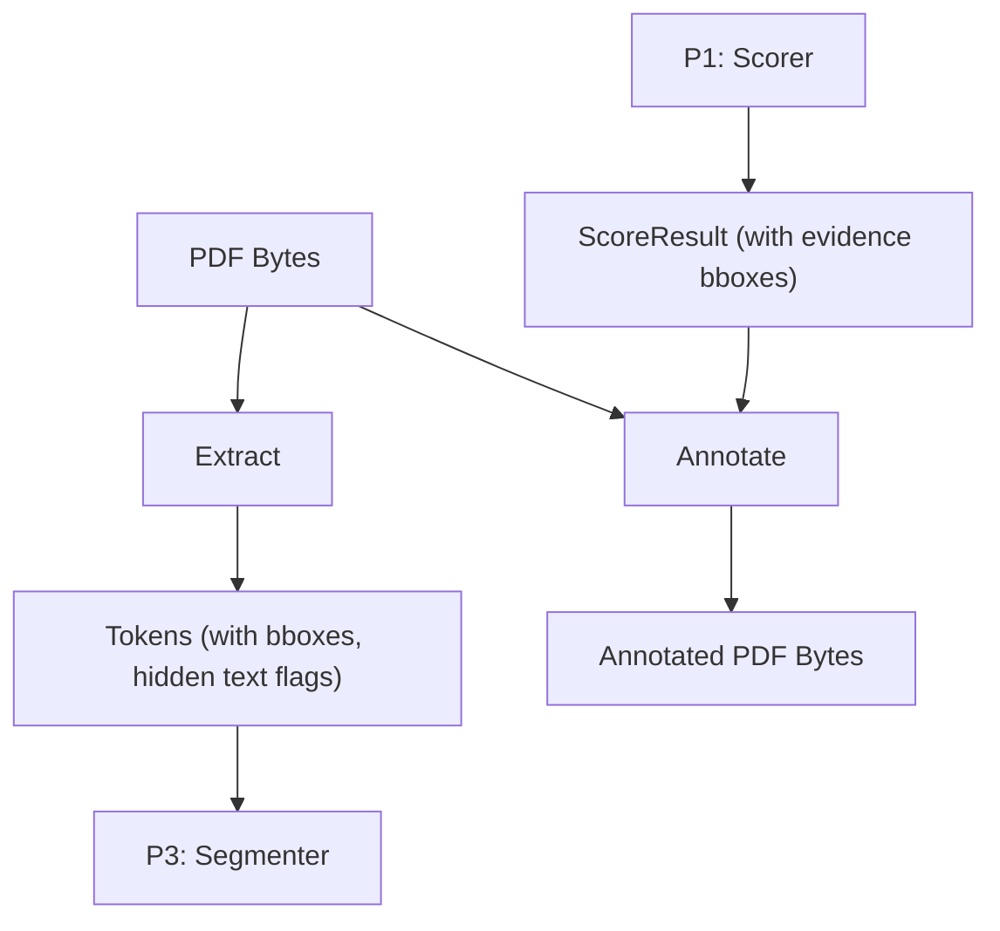

# P2 Walkthrough: Extraction & Annotation

## 1. What this module owns and how it connects to the others
This module owns the PDF processing layer. It takes raw PDF uploads from the FastAPI gateway (P1) and converts them into structured `Token` lists for the NLP segmenter (P3). Once grading is complete, it takes the `ScoreResult` from the scorer (P1) and draws highlights onto the original PDF to produce the annotated output for the frontend (P5).

## 2. Architecture in 60 seconds


## 3. Status board
| Item | Status | Evidence |
|---|---|---|
| Fixture PDFs | DONE | `dir backend\tests\fixtures\extraction\*.pdf` shows 5+ PDFs |
| Token Extraction (`extract()`) | DONE | `pytest backend/tests/unit/extraction/test_extraction.py` -> 10 passed |
| Hidden Text Detection | DONE | `pytest backend/tests/unit/extraction/test_extraction.py` |
| PDF Annotation (`annotate()`) | DONE | `python backend/tests/unit/extraction/visual_check.py` succeeds |
| OCR Fallback | TODO | UNVERIFIED |
| Real PDFs test | TODO | UNVERIFIED |

## 4. File map
- `backend/src/autorubric/extraction/`
  - `__init__.py`: Public interface for `extract()`. Switches between stub and real.
  - `real.py`: PyMuPDF logic to get words, check bounding boxes, and detect hidden text via `get_texttrace()`.
  - `stub.py`: Returns hard-coded tokens from `tokens.json`.
- `backend/src/autorubric/annotation/`
  - `__init__.py`: Public interface for `annotate()`. Switches between stub and real.
  - `real.py`: Takes `ScoreResult`, merges bboxes on the same line, draws PyMuPDF rectangles, adds margin text, and appends a summary page.
  - `stub.py`: Returns a static `annotated.pdf`.
- `backend/tests/fixtures/extraction/`
  - `generate_fixtures.py`: Script to build PDFs testing edges cases (hidden text, rotated pages, 2-column, etc).
  - `*.pdf`, `manifest.json`, `tokens.json`.
- `docs/screenshots/p2/`: PNGs showing the visual checks of `annotate()`.

## 5. How to run
```bash
# Run unit tests
pytest backend/tests/unit/extraction/test_extraction.py

# Run visual check for annotation
python backend/tests/unit/extraction/visual_check.py
```

## 6. Public function, inputs, outputs, example
```python
def extract(pdf_bytes: bytes) -> list[Token]: ...
def annotate(pdf_bytes: bytes, score: ScoreResult) -> bytes: ...
```

Example output of `extract`:
```json
[
  {
    "id": "t1_0_0_50_37",
    "text": "Rotated",
    "page": 1,
    "bbox": {"x": 50.0, "y": 37.0, "w": 42.0, "h": 16.4, "page": 1},
    "block_id": "b1_0",
    "is_hidden": false
  }
]
```

## 7. Method explained in plain words
**Extraction:** We use PyMuPDF to extract text from the PDF. First, we pull words using reading order sorting. We then use low-level text traces to determine the color, size, and render mode of each word. We flag a word as hidden if it is near-white, very small, located off the page, covered by an opaque rectangle, or drawn with an invisible render mode. 
**Annotation:** We group evidence boxes that lie on the same line to reduce visual clutter, then draw semi-transparent rectangles (Green for full credit, Amber for partial, Red for misconceptions, and grey-dashed for untrusted). We add a margin label for each highlight and append a text-based summary page at the end of the document.

## 8. Evaluation results
- Unit tests: 10/10 passing (verified).
- Performance: Extraction takes < 1s for short fixtures. (Large documents UNVERIFIED).

## 9. Key design decisions and why
- **PyMuPDF `get_texttrace()`:** We use this instead of `get_text("dict")` because it exposes low-level rendering modes (like `render_mode=3` for invisible text), which are necessary for prompt injection detection.
- **`STAGE_EXTRACTION_MODE` and `STAGE_ANNOTATION_MODE` switches:** These allow downstream modules to run without real PDFs during testing.
- **Bounding Box Merging:** Bounding boxes from the ML evidence are merged on the same line so the annotated PDF looks clean, rather than having a tiny box for every single word.

## 10. Known limitations
- OCR is currently not fully implemented. Image-only PDFs will return empty tokens unless an OCR backend like PaddleOCR is plugged into the `auto` mode.
- Handwriting is out of scope.
- `annotate()` currently attempts left margin placement if the right margin is full, but could still overlap if margins are very narrow.

## 11. What is left
- OCR fallback implementation using PaddleOCR.
- Test on real word/docs/scan exports (UNVERIFIED).

## 12. Viva prep
1. **Why PyMuPDF over pdfplumber?** PyMuPDF is faster and provides low-level access to text drawing commands (`get_texttrace`), essential for injection detection.
2. **How do you handle columns?** PyMuPDF's `get_text("words")` groups words into blocks. We sort by `block_no`, `line_no`, then `word_no`.
3. **What makes text "hidden"?** Tiny font (<2 pt), near-white color, off-page coordinates, invisible render modes, or being covered by a drawn opaque rectangle.
4. **Why don't you use PDF comments for annotations?** Many browser PDF viewers (like Chrome's default) don't render them well. Drawing shapes on the PDF directly guarantees they are visible.
5. **Why merge bounding boxes?** If a proposition spans 15 words, drawing 15 rectangles looks messy. Merging them produces a cleaner highlight block.
6. **How does rotation affect boxes?** We reset rotation to 0 during extraction so we extract unrotated coordinates, ensuring highlights land in the right spot later.
7. **What if the ML model hallucinates a bounding box?** The scorer strictly uses the evidence bboxes provided by the candidate matching, which came directly from our extraction. If they are invalid, they are simply skipped or logged.
8. **How does OCR fit in?** It's a fallback. If a page has no text layer, we can run PaddleOCR over the page pixmap to generate pseudo-tokens.
9. **Why is the summary page appended?** It acts as an easy-to-read rubric receipt for the student, regardless of the PDF viewer they use.
10. **How do you match words to their styling?** We check if the word's center is contained inside the bounding box of a `get_texttrace()` chunk.
11. **Are coordinates 0-indexed?** We use 1-indexed page numbers for our public contract, but subtract 1 internally for PyMuPDF.
12. **What if the document is encrypted?** We raise a `PermanentError`.

## 13. Change log
- Added PDF fixture generation for 11 cases (clean, two-column, 5 types of hidden text, table, rotated, image-only, multi-page).
- Built `extract()` using PyMuPDF `words` and `texttrace`.
- Built `annotate()` with highlighting, box merging, and a summary page.
- Created visual check scripts and screenshotted the output.
